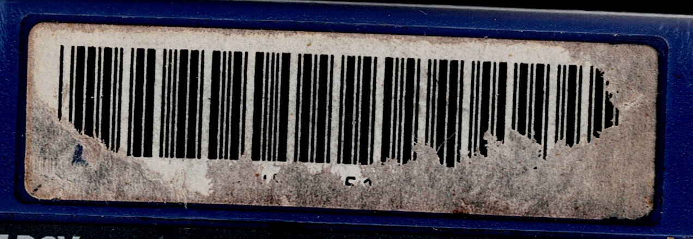
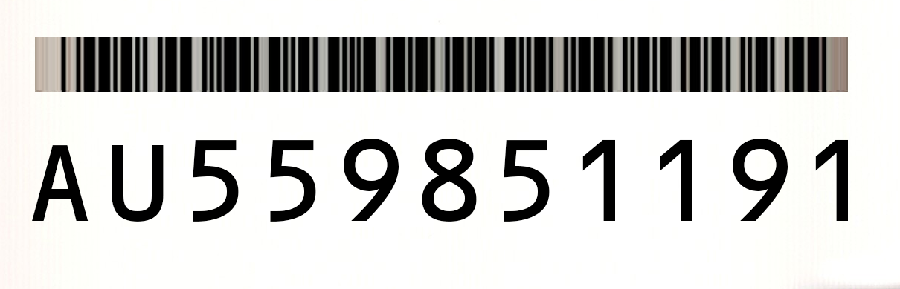
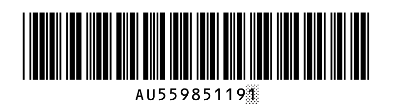
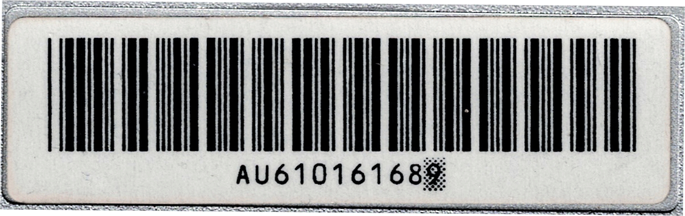
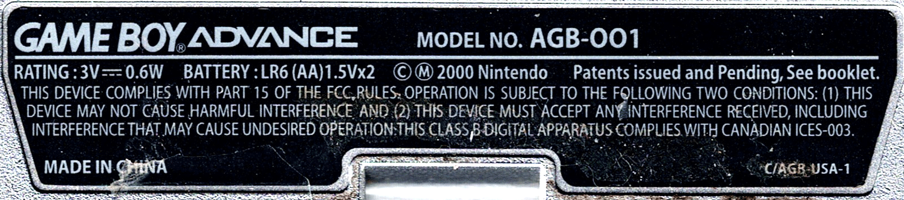
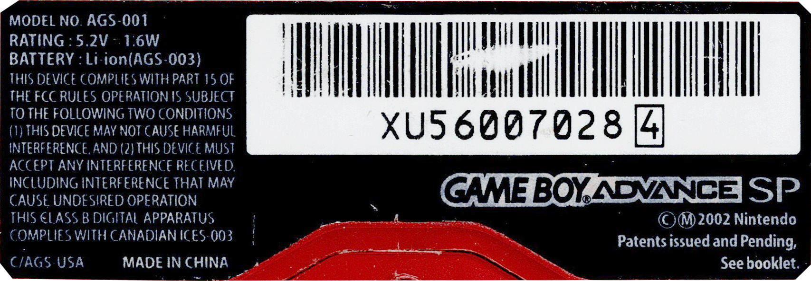

# Game Boy Label Creator

A small React + Vite app for designing and exporting Game Boy Advance cartridge labels. Pick a template, tweak the serial, colors, and border options, then download a print-ready, correctly sized SVG with all text converted to outlines.

## Live site

- https://charliesigma.github.io/gb-label-creator/

## About the project

The goal of this project was to recreate near-perfect (~99% accurate) replacement back stickers for the Game Boy family of consoles, starting with the AGB (Game Boy Advance) and AGS (Game Boy Advance SP). Achieving this level of accuracy required identifying the correct fonts and meticulously reproducing Nintendo’s original quirks, such as irregular text stretching, spacing, and alignment. Even the smallest details are preserved, like faithfully rendering the misprint “AGB-OO1” (with the letter O) instead of correcting it to “AGB-001” (with zero), exactly as Nintendo did. The sticker recreation was done with scans of original labels, Adobe Photoshop and Adobe Illustrator.

### The barcode from CGB and AGB

This project started when I bought a Game Boy Advance with a damaged serial number sticker. Although all numbers were missing, a portion of the barcode was still intact. By decoding that barcode, which encodes the serial number in Code 39, I was able to recover the original serial and set out to recreate the sticker as accurately as possible. The barcode is recreated with the serial number, using Libre Barcode 39 font stretched vertically to match the original serial height. The serial text is rendered with the OCR-B Sharp font, but with the number spacing manually tuned.

|     |     |     |
| --- | --- | --- |
| Original sticker | Decoded barcode | Recreated barcode |
|  |  |  |

I also validated the layout had the right proportions and positions by comparing with another serial barcode from another GBA:



### The AGB stickers

I took the same route and decided to recreate the AGB sticker for my US model AGB, since the ones included with my shell were very inaccurate. I started with the US model and did the EUR and JPN stickers as well. It's worth noting the US stickers don't include the serial number, but the European and Japanese versions do.



### The AGS stickers

When I bought my first Game Boy Advance SP I was disappointed to learn how bad the stickers included in the shells were, so decided to also recreate the AGS sticker for my US model AGS. On these stickers, I had to ensure the right slashed-zero font alternate for the 0 character was properly utilized.



## Highlights

- Pre-built templates covering multiple Game Boy variants and miscellaneous stickers.
- Editable serial, barcode, and colours.
- Optional border toggle for templates that expose light backgrounds.
- Downloads outlined, accurately-sized SVGs so no fonts are required when printing.

## Getting started

### Prerequisites

- Node.js 18 or newer

### Install and run the dev server

```
npm install
npm run dev
```

Vite will print a local URL and a LAN URL; open either in your browser to start editing.

### Build for production
```
npm run build
npm run preview
```

`npm run build` outputs static assets to `dist/`. Run `npm run preview` to serve that build locally.

## Project layout

- `src/App.tsx` – top-level UI, template selection, and value management.
- `src/templates/config.ts` – template definitions, default values, and field metadata.
- `src/lib/svg.ts` – applies field values to loaded SVGs and handles outline export.
- `public/templates/` – raw SVG template files referenced by the config.
- `src/assets/global.css` – layout and responsive styling.

## Adding or updating templates

1. Drop the source SVG into `public/templates/` and ensure elements you plan to edit have `data-*` attributes (e.g., `data-foreground`, `data-stroke`).
2. Add a matching entry to `src/templates/config.ts`, specifying defaults and `fields` for any editable serial, color, or toggle controls.
3. Restart `npm run dev` if it was already running so Vite picks up the new asset.

Once saved, the template appears in the dropdown and responds to the configured fields.

## Thank you

- [https://gbasp.ru/fakestickers-en.html](https://gbasp.ru/fakestickers-en.html) for being a great resource on AGS stickers.
- `Janni9009` for high-quality scans of AGB-EUR model.
- `amelia` for high-quality scans of AGB and AGS iQUE models.
- [/u/AchillesPDX](https://www.reddit.com/user/AchillesPDX/) for great-quality scan of the MGB barcode/serial.

## License

- Application code is released under the [MIT License](./LICENSE).
- SVG templates in `public/templates/` and any exported artwork are available under [CC BY 4.0](./LICENSE). Please credit **Charlie SIGMA** and link back to this repo or the live site when you use them.
